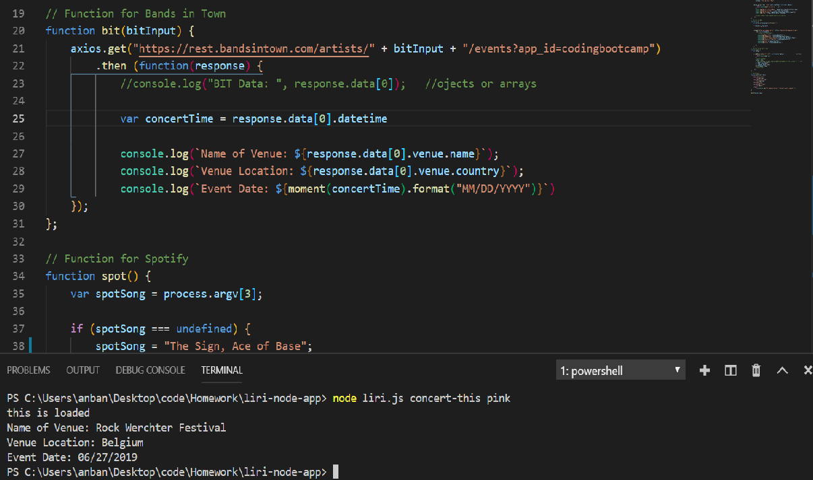
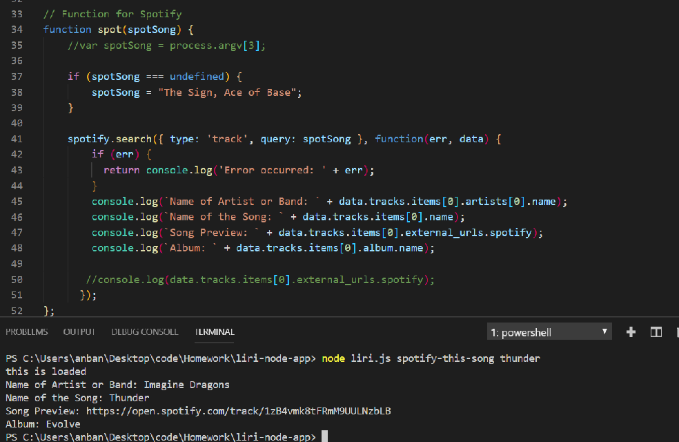
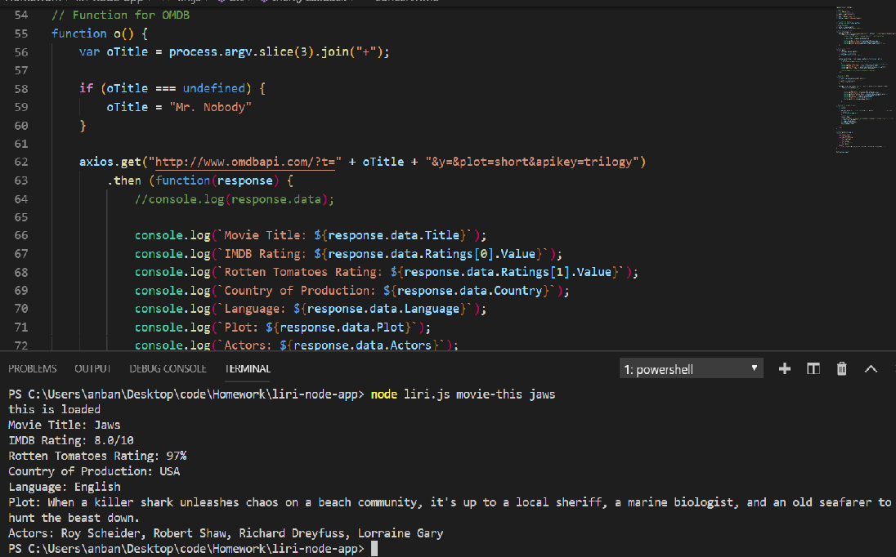
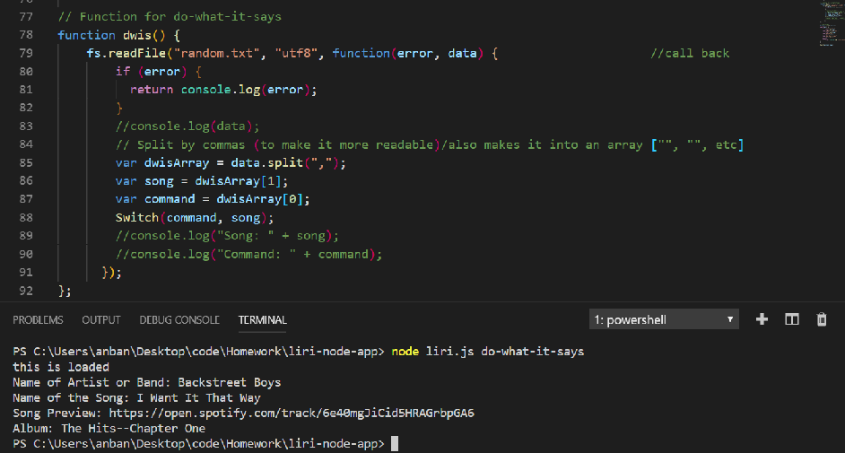

# liri-node-app

Link:
https://anban123.github.io/liri-node-app/

Screen Shots:
;
;
;
;

In this assignment, I made LIRI, which is like iPhone's SIRI. However, while SIRI is a Speech Interpretation and Recognition Interface, LIRI is a Language Interpretation and Recognition Interface. LIRI is a command line node app that takes in parameters and gives you back data.

Liri can help the user find a concert, song, or movie.  The user can enter one of four commands: "concert-this", "spotify-this-song", "movie-this", and "do-what-it-says" and Liri will pull the pertinent information through an API via axios/node packages for Bands in Town, Spotify, and OMDB.  I had to generate the necessary credentials for Spotify in order to get the propery API keys and I had to utilize the fs (file system) module in order to get Liri to read commands from a txt file for her fourth command, "do-what-it-says".  I also used moment.js to format the date of the concerts for Bands in Town. 

Liri Commands:
//concert-this           //node liri.js concert-this <artist/band name here>
//spotify-this-song      //node liri.js spotify-this-song '<song name here>'
//movie-this             //node liri.js movie-this '<movie name here>'
//do-what-it-says        //node liri.js do-what-it-says

Below are the instructions:
-Clearly state the problem the app is trying to solve (i.e. what is it doing and why)
-Give a high-level overview of how the app is organized
-Give start-to-finish instructions on how to run the app
-Include screenshots, gifs or videos of the app functioning
-Contain a link to a deployed version of the app
-Clearly list the technologies used in the app
-State your role in the app development

